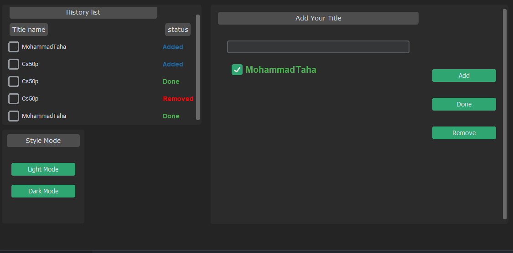
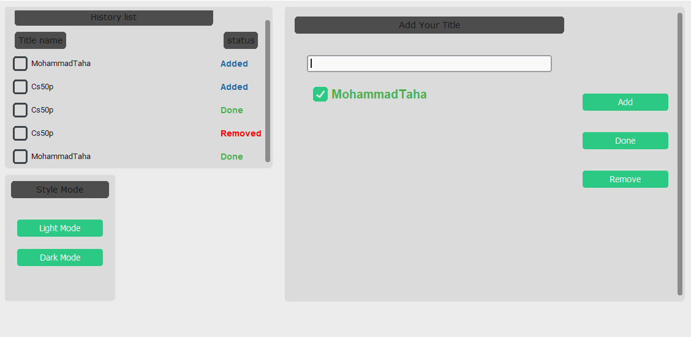

# To-Do List
### Video Demo:  https://youtu.be/z9_Kqoj1AOE

---

### Description:
This application is a To-Do list manager built using the customtkinter library, featuring a dark theme and a user-friendly interface. It allows users to add, remove, and manage tasks while displaying a history of actions. The layout is organized into a grid with designated areas for task entry, history, and style settings. Additionally, it provides warning messages for user errors, enhancing the overall user experience.

## Classes
1. **MyStylebox**

    The MyStylebox class creates a frame for selecting the application's appearance mode, featuring buttons for switching between light and dark themes. It includes a title label and two buttons, each with specific commands to change the style mode.

2. **History_list**

    The History_list class manages a scrollable frame that displays a history of actions taken in the To-Do application. It features methods to show whether the history list is empty, save actions to a CSV file, and load existing history items, displaying their status as "Added," "Removed," or "Done" with corresponding labels and checkboxes for each item.

3. **EntryBox**

    The EntryBox class manages the input area for adding tasks to the To-Do list. It includes functionality to add, mark as done, and remove items, while maintaining a history of actions. The class features methods to save and load task data from a JSON file, display warnings for user errors, and update the grid layout dynamically as items are added or removed. Each task is represented by a checkbox, and the status of tasks (added, done, removed) is tracked and displayed in a linked History_list.

4. **Todo**

    The Todo class initializes the main application window for the To-Do list manager, setting the title, size, appearance mode, and layout configuration. It organizes the interface into a grid with designated areas for the history list, style mode selection, and task entry. The EachClass function instantiates and arranges the History_list, MyStylebox, and EntryBox components within the main window, ensuring a cohesive user experience.

